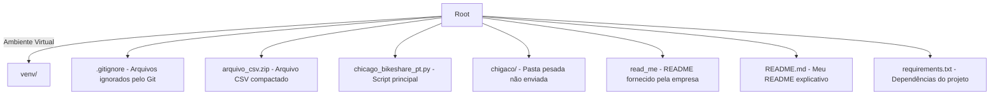

# Resolução do case 

## Descrição

Este repositório contém a solução de um case técnico enviado para avaliação do processo seletivo para a vaga de Engenheiro de Dados. O objetivo foi resolver o desafio proposto e apresentar afim de medir o conhecimento dentro do contexto de engenharia de dados. Neste repositório encontraremos também uma proposta de Arquitetura de um Data Lake.

## Tecnologias Utilizadas

### **Python 3.11**


## Estrutura do Repositório



## Como Executar o Projeto

### Clone este repositório:
```
https://github.com/CunhaLucas22/desafio-tecnico-cerc.git
```

### Crie um ambiente virtual:
```
python -m venv venv
```

### Instale as dependências:
```
pip install -r requirements.txt
```

### Extraia o arquivo CSV compactado:
```
arquivo_csv.zip 
```

### Execute o script principal:
```
chicago_bikeshare_pt.py
```
